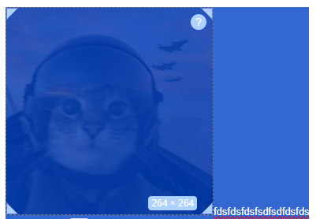

<p align="center">
  
</p>
<p align="center"> <h1 align="center">resize-quill-image</h1> </p>
<p align="center">
  
  
  
  
  
  <a href="https://resize-quill-image.vercel.app/">
    
  </a>
</p>

`resize-quill-image` is a lightweight Quill module that enables image resizing inside the editor.

This module was originally created because we needed a working image resize solution for our own project.
Most existing Quill modules were either deprecated or not updated for the latest Quill versions.
While there are a few small issues, they're usually project-specific and not caused by the module itself.
You can find these cases and their solutions in the [Problems](#problems) section.

---
- [Demo](#demo)
- [Installation](#installation)
  - [npm](#npm)
  - [CDN](#cdn)
- [Usage](#usage)
  - [Import the module](#1-import-the-module)
  - [Register the module with Quill](#2-register-the-module-with-quill)
  - [Configure the Quill editor](#3-configure-the-quill-editor)
- [Options](#options)
  - [Option Descriptions](#option-descriptions)
  - [Style Options](#style-options)
- [Keyboard Shortcuts](#keyboard-shortcuts)
- [TypeScript](#typescript)
- [Cleanup / Destroy](#cleanup--destroy)
  - [Usage](#usage-1)
  - [When to use](#when-to-use)
  - [Example with unmount](#example-with-unmount)
- [Problems](#problems)
  - [Resize overlay goes outside the editor](#problem-resize-overlay-goes-outside-the-editor)
  - [Image resize handles and border do not appear](#problem-image-resize-handles-and-border-do-not-appear)
- [License](#license)

---
## [Demo](#demo)
### Live
[Check out the live demo](https://resize-quill-image.vercel.app/)
### GIF


## [Installation](#installation)

### [npm](#npm)

```bash
npm install resize-quill-image
```

> **Compatible with [`react-quill-new`](https://www.npmjs.com/package/react-quill-new)** — works out of the box since `react-quill-new` uses Quill 2.x under the hood.

### [CDN](#cdn)

Load Quill first, then the module. The module exposes a global `ImageResize` variable.

**unpkg:**
```html
<link href="https://unpkg.com/quill@2.0.3/dist/quill.snow.css" rel="stylesheet">
<script src="https://cdnjs.cloudflare.com/ajax/libs/highlight.js/11.9.0/highlight.min.js"></script>
<script src="https://unpkg.com/quill@2.0.3/dist/quill.js"></script>
<script src="https://unpkg.com/resize-quill-image/dist/index.iife.js"></script>
```

**jsDelivr:**
```html
<link href="https://cdn.jsdelivr.net/npm/quill@2.0.3/dist/quill.snow.css" rel="stylesheet">
<script src="https://cdnjs.cloudflare.com/ajax/libs/highlight.js/11.9.0/highlight.min.js"></script>
<script src="https://cdn.jsdelivr.net/npm/quill@2.0.3/dist/quill.js"></script>
<script src="https://cdn.jsdelivr.net/npm/resize-quill-image/dist/index.iife.js"></script>
```

You can pin to a specific version:
```html
<script src="https://unpkg.com/resize-quill-image@1.0.10/dist/index.iife.js"></script>
```

Then register and use it:
```html
<script>
  Quill.register('modules/imageResize', ImageResize);

  const quill = new Quill('#editor', {
    theme: 'snow',
    modules: {
      toolbar: [['bold', 'italic'], ['image']],
      imageResize: {}
    }
  });
</script>
```

> **Note:** Quill must be loaded before `resize-quill-image`. The IIFE build reads `Quill` from the global scope at load time.

> **Note:** Quill 2.x CDN support requires **`resize-quill-image@1.0.10`** or later. Earlier versions will throw an error when used with Quill 2.x via CDN.

---

## [Usage](#usage)

### 1. Import the module

```js
import ImageResize from 'resize-quill-image';
```

### 2. Register the module with Quill

```js
Quill.register('modules/imageResize', ImageResize);
```

### 3. Configure the Quill editor

```js
const quill = new Quill(editorContainer, {
  modules: {
    syntax: true,
    toolbar: toolbarOptions,
    imageResize: true
  },
  placeholder: 'Compose an epic...',
  theme: 'snow'
});
```

---

## [Options](#options)

You can configure the behavior of `resize-quill-image` by passing options inside your Quill config:

```js
imageResize: {
  helpIcon: true,
  displaySize: true,
  styleSelection: true
}
```

### [Option Descriptions](#option-descriptions)

| Option             | Type      | Default           | Description |
|--------------------|-----------|-------------------|-------------|
| `helpIcon`         | `boolean` | `true`            | Shows a `?` icon on the image overlay. Describes keyboard shortcuts:<br>• `Shift` → vertical<br>• `Alt` → horizontal<br>• `Ctrl` → custom/free resize <br>  |
| `displaySize`      | `boolean` | `true`            | Displays current image width and height as a badge while resizing. <br>  |
| `styleSelection`   | `boolean` | `true`            | Disables the blue selection overlay. To keep default behavior: `imageResize: { styleSelection: false }` <br>  |
| `minWidth`         | `number`  | `16`              | Minimum image width in pixels. |
| `minHeight`        | `number`  | `16`              | Minimum image height in pixels. |
| `positions`        | `array`   | 4 corners         | Array of handle position objects that control where resize handles appear on the image. Each object takes `{ top?, left?, right?, bottom?, clipPath? }`. |

### [Style Options](#style-options)

You can customize three visual elements. All style options accept a plain object of CSS properties (camelCase keys, string or number values). Your values are **merged with the defaults** — you only need to pass what you want to override.

| Option              | Customizes |
|---------------------|------------|
| `overlayStyles`     | The dashed border that appears around the selected image. |
| `handleStyles`      | The corner resize handles. |
| `displaySizeStyles` | The width × height badge shown while resizing. |

**Example:**

```js
const quill = new Quill(editorContainer, {
  modules: {
    toolbar: toolbarOptions,
    imageResize: {
      helpIcon: true,
      displaySize: true,
      styleSelection: true,
      minWidth: 20,
      minHeight: 20,
      overlayStyles: {
        border: '2px solid red',
      },
      handleStyles: {
        backgroundColor: '#ff0000',
        width: '12px',
        height: '12px',
      },
      displaySizeStyles: {
        backgroundColor: '#000',
        color: '#fff',
      },
      positions: [
        { top: 0, left: 0, clipPath: 'polygon(0% 0%, 100% 0%, 0% 100%)' },
        { top: 0, right: 0, clipPath: 'polygon(100% 0%, 0% 0%, 100% 100%)' },
        { bottom: 0, left: 0, clipPath: 'polygon(0% 100%, 100% 100%, 0% 0%)' },
        { bottom: 0, right: 0, clipPath: 'polygon(100% 100%, 0% 100%, 100% 0%)' },
      ],
    },
  },
  theme: 'snow',
});
```

---

## [Keyboard Shortcuts](#keyboard-shortcuts)

While dragging a resize handle, hold a modifier key to change resize behavior:

| Key     | Behavior |
|---------|-----------|
| *(none)*  | Proportional resize — maintains aspect ratio |
| `Shift` | Vertical only — changes height, width is unchanged |
| `Alt`   | Horizontal only — changes width, height is unchanged |
| `Ctrl`  | Free resize — width and height change independently |

These shortcuts are also shown in the `?` tooltip on the overlay when `helpIcon: true`.

---

## [TypeScript](#typescript)

This package ships TypeScript definitions. All option interfaces are exported for use in your own types:

```ts
import ImageResize from 'resize-quill-image';
import type { ImageResizeOptions, HandlePosition, CSSStyles } from 'resize-quill-image';

const options: ImageResizeOptions = {
  helpIcon: true,
  displaySize: true,
  minWidth: 20,
  overlayStyles: { border: '2px dashed #999' },
  handleStyles: { backgroundColor: '#ff0000' },
};
```

---

## [Cleanup / Destroy](#cleanup--destroy)

If you're dynamically mounting and unmounting the Quill editor (for example in a Single Page Application or during route changes), it's important to properly **clean up** the `resize-quill-image` module to avoid memory leaks or event duplication.

This module provides a `destroy()` method that you can call when tearing down your Quill instance.

### [Usage](#usage-1)

Call `destroy()` **before** clearing the DOM:

```js
const imageResizeModule = quill.getModule('imageResize');

if (imageResizeModule?.destroy) {
  imageResizeModule.destroy();
}

container.innerHTML = '';
```

> **Important:** Always call `destroy()` before removing the editor from the DOM. Clearing the DOM first can cause errors inside `destroy()` as it tries to clean up elements that no longer exist.

This will:

- Remove all event listeners (`click`, `selection-change`, `text-change`)
- Remove any visible resize overlays or handles
- Clean up drag and tooltip controllers
- Reset internal references for garbage collection

### [When to use](#when-to-use)

- If you're unmounting your editor component
- If you're switching pages in an SPA
- If you're reinitializing Quill manually

### [Example with unmount](#example-with-unmount)

```js
useEffect(() => {
  const quill = new Quill(editorRef.current, { ... });

  return () => {
    const module = quill.getModule('imageResize');
    if (module?.destroy) module.destroy();
    editorRef.current.innerHTML = '';
  };
}, []);
```

This helps ensure your editor stays clean and efficient across mounts.

---

## [Problems](#problems)

### <ins>Problem: Resize overlay goes outside the editor</ins>

If your `.ql-container` has a fixed height like this:

```css
.ql-container {
  height: 500px;
}
```

Then the resize overlay may appear cut off or outside the bounds of the editor when the image goes beyond the height.

**Solution:**

Instead of a fixed height, use `min-height` and `max-height`:

```css
.ql-container {
  min-height: 500px;
  max-height: 500px;
  overflow: auto;
}
```

This keeps the resize functionality working correctly and fully visible.

### <ins>Problem: Image resize handles and border do not appear</ins>

If you don't see the image resize handles or overlay border, make sure you’ve included `highlight.js`.  
Quill’s `syntax` module depends on it, and without it, modules like `imageResize` may silently fail to render overlays.

Add this to your HTML:

```html
<script src="https://cdnjs.cloudflare.com/ajax/libs/highlight.js/11.9.0/highlight.min.js"></script>
```

More info in the Quill docs for newer highlight.js cdn version:
https://quilljs.com/docs/modules/syntax#syntax-highlighter-module

## [License](#license)

MIT License
Free for personal and commercial use.

---
> [!NOTE]
> If you encounter any bugs, memory leaks, or unexpected behavior, feel free to open an issue on the [GitHub repository](https://github.com/littlenines/resize-quill-image/issues).
> Your feedback helps make the module better for everyone.
> If you want to contribute to the project — whether it's fixing a bug or improving performance — your contributions are welcome and appreciated.

> [!TIP]
> If you just want the code and prefer to build your own module on top of it, you're free to do that.
> Everything is located in the `/src` directory for full access and customization.


